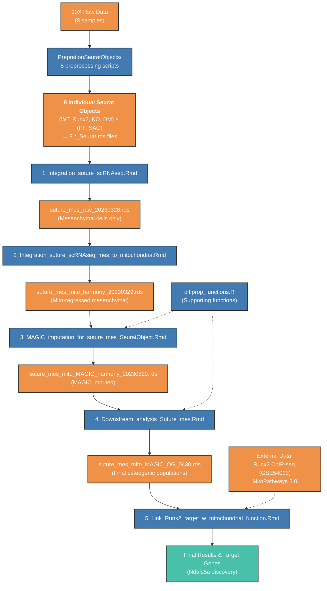

# 338_suture_paper code

Welcome to the 338_suture_paper code repository. This is a comprehensive analysis project for studying mouse suture development and miR-338 function, currently under peer review.

This repository contains two main analysis modules: miRNASeq analysis and single-cell RNA sequencing (scRNASeq) analysis, designed to investigate the molecular mechanisms of P9 mouse sutures across different genotypes.

## Project Structure

### 📁 miRNASeq/ - microRNA Sequencing Analysis

This directory contains comprehensive analysis workflows for microRNA and mRNA sequencing data from mouse suture tissues.

#### Main Analysis Files:

- **`1.1_SAG_suture_RNAseq.Rmd`** - SAG suture RNA-seq differential expression analysis in gene mode
  - Differential gene expression analysis using sleuth package
  - Comparison of gene expression changes between D0 vs D7 timepoints

- **`1.2_PF_suture_RNAseq.Rmd`** - PF suture RNA-seq differential expression analysis in gene mode
  - Parallel analysis for PF suture differential gene expression

- **`1.3_PF_SAG_suture_mRNA_cluster_0430.Rmd`** - PF and SAG suture mRNA clustering analysis
  - Integration of mRNA expression data from both PF and SAG sutures
  - Clustering analysis to identify common and specific expression patterns

- **`1.4_PF_SAG_suture_miRNAseq_DEG.Rmd`** - miRNA sequencing differential expression analysis
  - Analysis of miRNA expression changes
  - Identification of differentially expressed miRNAs related to suture development

- **`1.5_PF_SAG_suture_miRNA_cluster_0430.Rmd`** - miRNA clustering analysis
  - Clustering analysis of miRNA expression data
  - Identification of miRNA expression patterns

- **`1.6_PF_SAG_suture_miRNA_RNA_integration.Rmd`** - miRNA-mRNA integration analysis
  - Integration of miRNA and mRNA expression data
  - Analysis of miRNA-mRNA regulatory networks

#### Output Data Directory:
- **`OutputData/`** - Contains all analysis output files, including:
  - miRNA expression count tables (`miR_PF_count.csv`, `miR_SAG_count.csv`)
  - Differential expression results (`PF_miR_sig.csv`, `SAG_miR_sig.csv`)
  - miRNA-mRNA interaction data (`DBT_miRNA_result.csv`, `UBT_miRNA_result.csv`)
  - Gene expression matrices and significance analysis results

### 📁 scRNASeq/ - Single-cell RNA Sequencing Analysis

This directory contains the complete single-cell RNA sequencing analysis workflow for P9 mouse suture tissues, covering 8 samples from 4 genotypes (WT, Runx2 heterozygous, miR-338 knockout, double mutant) and 2 suture types (PF, SAG).

#### Core Analysis Pipeline:

- **`1_integration_suture_scRNAseq.Rmd`** - Data integration and batch effect removal
  - Integration of 8 Seurat objects
  - Batch effect removal using Harmony algorithm
  - Cell type annotation and mesenchymal cell extraction

- **`2_Integration_suture_scRNAseq_mes_to_mitochondria.Rmd`** - Mesenchymal cell analysis with mitochondrial regression
  - Focus on mesenchymal cell analysis
  - Regression of mitochondrial gene effects
  - Identification of osteogenic cell subpopulations (OG1, OG2, OG3)

- **`3_MAGIC_imputation_for_suture_mes_SeuratObject.Rmd`** - MAGIC imputation analysis
  - Application of MAGIC algorithm for gene expression imputation
  - Enhancement of gene expression signal detection
  - Generation of subset objects grouped by genotype and suture type

- **`4_Downstream_analysis_Suture_mes.Rmd`** - Comprehensive downstream analysis
  - Marker gene identification
  - K-means clustering analysis
  - Differential expression analysis between genotypes
  - Mitochondrial respiration pathway analysis

- **`5_Link_Runx2_target_w_mitochondrial_function.Rmd`** - Runx2 target gene and mitochondrial function association analysis
  - Integration of Runx2 ChIP-seq data
  - Identification of direct Runx2 target genes
  - Discovery of Ndufs5a as a key regulatory target

#### Supporting Files:
- **`diffprop_functions.R`** - Differential proportion analysis functions
  - Contains functions for statistical analysis of cell type proportions
  - Used in steps 3 and 4 for differential cell proportion analysis

- **`scRNASeq_Workflow.md`** - Detailed analysis workflow documentation
  - Complete analysis workflow description
  - Input/output file details for each step
  - Software dependencies and computational resource requirements

#### Preparation Directory:
- **`PreprationSeuratObjects/`** - Seurat object preprocessing
  - Contains 8 preprocessing scripts, one for each sample
  - Creates Seurat objects from 10X Genomics raw data
  - Basic quality control, normalization, and dimensionality reduction

## Key Findings

- **miRNA Regulatory Networks**: Identification of key miRNA-mRNA regulatory pairs related to suture development
- **Cell Type Specificity**: Discovery of cell type proportion changes across different genotypes
- **Mitochondrial Function**: Revelation of Runx2's role in regulating mitochondrial function through direct control of Ndufs5a
- **Developmental Timeline**: Elucidation of molecular event sequences during suture development

## Software Dependencies

### R Packages:
- Seurat, SeuratWrappers, sctransform
- harmony (batch effect removal)
- sleuth (RNA-seq analysis)
- ggplot2, dplyr, tidyverse (data visualization and processing)
- monocle3, clustree (trajectory analysis and clustering)

### Python Environment:
- MAGIC algorithm environment (for gene expression imputation)

### External Data:
- Runx2 ChIP-seq data (GSE54013)
- MitoPathways 3.0 gene sets

## Key Data Flow

The following diagram illustrates the complete data flow from raw 10X data through all analysis steps, showing key input and output files for each script:

## Usage Instructions

1. **Preparation Phase**: Run all scripts in `PreprationSeuratObjects/` (can be run in parallel)
2. **Main Analysis Pipeline**: Run scripts 1-5 in scRNASeq/ directory sequentially
3. **miRNA Analysis**: Run analysis scripts in miRNASeq/ directory

## Acknowledgments

### Differential Proportion Analysis Methods

The functions in `diffprop_functions.R` are adapted from the methodology described in:

**Farbehi, N., Patrick, R., Dorison, A., Xaymardan, M., Janbandhu, V., Wystub-Lis, K., Ho, J.W.K., Nordon, R.E., Harvey, R.P.** (2019). Single-cell expression profiling reveals dynamic flux of cardiac stromal, vascular and immune cells in health and injury. *eLife* 8:e43882. https://doi.org/10.7554/eLife.43882

The differential proportion analysis approach enables statistical comparison of cell type proportions between experimental conditions using permutation-based testing, which is particularly valuable for identifying condition-specific changes in cellular composition within single-cell datasets.

---

*This project serves as the supporting code for 338_suture_paper. For detailed methodological descriptions, please refer to the corresponding academic publication.*