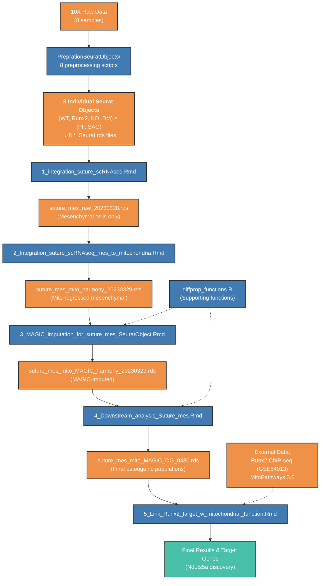

# scRNASeq Analysis Workflow

This document outlines the complete workflow for single-cell RNA sequencing analysis of P9 mouse suture samples across different genotypes and suture types.

## Key Data Flow

The following diagram illustrates the complete data flow from raw 10X data through all analysis steps, showing key input and output files for each script:

## Overview

The workflow consists of two main phases:
1. **Preparation Phase**: Individual Seurat object creation for each sample
2. **Analysis Phase**: Integration, processing, and downstream analysis

## Samples and Genotypes

| Genotype | Description | Suture Types |
|----------|-------------|--------------|
| WT | Wildtype | PF, SAG |
| Runx2 | Runx2 Heterozygous | PF, SAG |
| KO | miR-338 Knockout | PF, SAG |
| DM | Double Mutant | PF, SAG |

**Total Samples**: 8 (4 genotypes × 2 suture types)

---

## Phase 1: Preparation of Seurat Objects
### Location: `PreprationSeuratObjects/` folder

These scripts create individual Seurat objects from 10X Genomics output for each sample:

### Input Requirements
- 10X Genomics output folders for each sample (e.g., `WT_PF/`, `WT_SAG/`, etc.)
- Each folder should contain standard 10X output files: `barcodes.tsv`, `features.tsv`, `matrix.mtx`

### Processing Steps (for each sample)
1. **Data Loading**: Read 10X datasets using `Read10X()`
2. **Seurat Object Creation**: Create Seurat object with filtering (min.cells = 3, min.features = 200)
3. **Quality Control**: Calculate mitochondrial gene percentages
4. **Normalization**: SCTransform normalization
5. **Dimensionality Reduction**: PCA and UMAP
6. **Clustering**: Graph-based clustering
7. **Save Objects**: Both raw and processed versions

### Scripts and Outputs

| Script | Sample | Key Outputs |
|--------|--------|-------------|
| `0_WT_PF_seurat.Rmd` | Wildtype PF | `WT_PF_raw.rds`, `WT_PF_Seurat.rds` |
| `0_WT_SAG_seurat.Rmd` | Wildtype SAG | `WT_SAG_raw.rds`, `WT_SAG_Seurat.rds` |
| `0_Runx2_PF_seurat.Rmd` | Runx2Het PF | `Runx2_PF_raw.rds`, `Runx2_PF_Seurat.rds` |
| `0_Runx2_SAG_seurat.Rmd` | Runx2Het SAG | `Runx2_SAG_raw.rds`, `Runx2_SAG_Seurat.rds` |
| `0_KO_PF_seurat.Rmd` | miR-338 KO PF | `KO_PF_raw.rds`, `KO_PF_Seurat.rds` |
| `0_KO_SAG_seurat.Rmd` | miR-338 KO SAG | `KO_SAG_raw.rds`, `KO_SAG_Seurat.rds` |
| `0_DM_PF_seurat.Rmd` | Double Mutant PF | `DM_PF_raw.rds`, `DM_PF_Seurat.rds` |
| `0_DM_SAG_seurat.Rmd` | Double Mutant SAG | `DM_SAG_raw.rds`, `DM_SAG_Seurat.rds` |

**Required R Packages**: Seurat, ggplot2, sctransform, FlexDotPlot, tidyverse

---

## Phase 2: Main Analysis Pipeline

### Step 1: Integration (`1_integration_suture_scRNAseq.Rmd`)

**Purpose**: Integrate all 8 Seurat objects and remove batch effects

**Input Files**:
- `WT_PF_Seurat.rds`
- `WT_SAG_Seurat.rds` 
- `Runx2_PF_Seurat.rds`
- `Runx2_SAG_Seurat.rds`
- `KO_PF_Seurat.rds`
- `KO_SAG_Seurat.rds`
- `DM_PF_Seurat.rds`
- `DM_SAG_Seurat.rds`

**Key Processing Steps**:
1. Load all 8 Seurat objects
2. Merge objects with unique cell identifiers
3. Re-perform SCTransform on split objects
4. Select integration features (3000 features)
5. Run PCA on SCT assay
6. **Harmony Integration**: Remove batch effects using Harmony
7. UMAP and clustering on harmony reduction
8. Cell type annotation
9. Extract mesenchymal cell population

**Key Output Files**:
- `suture_harmony_20221120.rds` - Initial integrated object
- `suture_harmony_celltype_20230328.rds` - With cell type annotations
- `suture_mes_raw_20230328.rds` - **Mesenchymal cells only** (input for Step 2)
- `suture_other_raw_20230328.rds` - Non-mesenchymal cells

**Required R Packages**: Seurat, SeuratWrappers, sctransform, harmony, data.table, ggplot2, monocle3, magrittr, dplyr, tidyverse, cowplot, clustree

---

### Step 2: Mesenchymal Cell Analysis with Mitochondrial Regression (`2_Integration_suture_scRNAseq_mes_to_mitochondria.Rmd`)

**Purpose**: Focus on mesenchymal cells and regress out mitochondrial gene effects

**Input File**: `suture_mes_raw_20230328.rds` (from Step 1)

**Key Processing Steps**:
1. Load mesenchymal cell object
2. **Re-run SCTransform with mitochondrial regression** (`vars.to.regress = "percent.mt"`)
3. Re-perform Harmony integration
4. New UMAP and clustering
5. Subset by suture type (PF vs SAG)
6. Identify osteogenic populations (OG1, OG2, OG3)

**Key Output Files**:
- `suture_mes_mito_harmony_20230329.rds` - **Mito-regressed mesenchymal object** (input for Step 3)
- `suture_mes_mito_harmony_renamed.rds` - With renamed clusters
- `suture_mes_mito_PF_seurat_20230330.rds` - PF-specific subset
- `suture_mes_mito_SAG_seurat_20230330.rds` - SAG-specific subset
- `suture_mes_mito_OG_seurat_20230330.rds` - Osteogenic populations

**Required R Packages**: Seurat, SeuratWrappers, sctransform, harmony, data.table, ggplot2, monocle3, magrittr, dplyr, tidyverse, cowplot, clustree, gridExtra, CellChat

---

### Step 3: MAGIC Imputation (`3_MAGIC_imputation_for_suture_mes_SeuratObject.Rmd`)

**Purpose**: Apply MAGIC imputation to improve gene expression signal detection

**Input File**: `suture_mes_mito_harmony_20230329.rds` (from Step 2)

**Key Processing Steps**:
1. Set up Python MAGIC environment
2. Extract RNA count matrix
3. Filter genes (expressed in >10 cells)
4. **Run MAGIC imputation** using Python
5. Create new Seurat object with MAGIC-imputed data
6. Re-perform dimensionality reduction and clustering
7. Generate subset objects by genotype and suture type
8. Extract and save osteogenic population subsets

**Key Output Files**:
- `suture_mes_mito_MAGIC_harmony_20230329.rds` - **MAGIC-imputed object** (input for Step 4)
- `suture_mes_mito_MAGIC_harmony_renamed.rds` - With renamed clusters
- Genotype-specific objects (WT, KO, Runx2, DM for both PF and SAG)
- `suture_mes_mito_MAGIC_OG_seurat_20230330.rds` - Osteogenic populations

**Additional Dependencies**:
- `diffprop_functions.R` - Used for differential proportion analysis between genotypes

**Required R Packages**: reticulate, Seurat, SeuratWrappers, sctransform, harmony, data.table, ggplot2, monocle3, magrittr, dplyr, tidyverse, cowplot, clustree, gridExtra, phateR, viridis, Rmagic

**Python Dependencies**: MAGIC conda environment

---

### Step 4: Downstream Analysis (`4_Downstream_analysis_Suture_mes.Rmd`)

**Purpose**: Comprehensive downstream analysis focusing on differential expression and pathway analysis

**Input File**: `suture_mes_mito_MAGIC_harmony_20230329.rds` (from Step 3)

**Key Processing Steps**:
1. Load MAGIC-imputed object
2. Remove high mitochondrial clusters (14, 15)
3. **Marker gene identification** using RNA assay
4. **K-means clustering** (final clustering method adopted)
5. Differential expression analysis between genotypes
6. Focus on OG3 population differences
7. Mitochondrial respiration pathway analysis
8. Identification of potential targets (e.g., CDK8)

**Key Output Files**:
- `suture_mes_mito_MAGIC_harmony_renamed_20250420.rds` - Final processed object
- `suture_mes_mito_MAGIC_OG_0430.rds` - **Final osteogenic populations** (input for Step 5)
- Various subset objects by suture type
- Marker gene tables and figures

**Additional Dependencies**:
- `diffprop_functions.R` - Used for differential proportion analysis and statistical testing

**Required R Packages**: ggplot2, Seurat, SeuratObject, RColorBrewer, dplyr, magrittr

---

### Step 5: Runx2 Target Analysis (`5_Link_Runx2_target_w_mitochondrial_function.Rmd`)

**Purpose**: Link Runx2 targets with mitochondrial function using ChIP-seq data

**Input File**: `suture_mes_mito_MAGIC_OG_0430.rds` (from Step 4)

**Key Processing Steps**:
1. Load final osteogenic populations
2. Subset to Runx2Het vs WT comparison
3. Load mitochondrial gene sets (MitoPathways 3.0)
4. **Integrate Runx2 ChIP-seq data** (GSE54013, D0 and D9 timepoints)
5. Identify direct Runx2 targets in PF and SAG
6. **Discover Ndufs5a as common direct target**
7. Link Runx2 regulation to mitochondrial function

**Key Output Files**:
- `suture_mes_mito_MAGIC_OG_seurat_Runx2HetVSWT_20240309.rds` - Runx2/WT subset
- `mitocarta_mouse_3.rds` - Mitochondrial gene sets

**External Data**: Runx2 ChIP-seq results from GSE54013

**Required R Packages**: ggplot2, Seurat, SeuratObject, data.table, slingshot, magrittr, dplyr, cowplot, gridExtra, viridis, Hmisc, ggpubr, rsample, tidymodels, scCustomize, pheatmap, RColorBrewer, sigPathway

---

## Critical Dependencies

### Software Requirements
- R (≥4.0)
- Python with MAGIC environment
- Required R packages (see individual steps)

### Data Requirements
- 10X Genomics output for all 8 samples
- Runx2 ChIP-seq data (GSE54013)
- MitoPathways 3.0 gene sets

### Additional Scripts
- `diffprop_functions.R` - Contains differential proportion analysis functions used in Steps 3 and 4
  - **Purpose**: Statistical testing for differential cell type proportions between conditions
  - **Key Functions**: `generateNull()`, `two.class.test()`, `simCells()`, `makeVariables()`
  - **Usage**: Permutation-based statistical testing to identify significant changes in cell population proportions

### Computational Resources
- Sufficient memory for large Seurat objects (>60,000 cells total)
- MAGIC imputation requires substantial computation time

## Notes

1. **Critical Handoff Points**: Each step produces specific output files that serve as inputs for the next step
2. **Quality Control**: Mitochondrial gene regression is performed specifically in Step 2
3. **Final Clustering**: K-means clustering method is adopted in Step 4
4. **Key Finding**: Ndufs5a identified as direct common Runx2 target linking to mitochondrial function
5. **File Naming**: Date stamps in filenames indicate processing versions (e.g., 20230328, 20230329)

## Execution Order

The scripts must be run in the following order:
1. All preparation scripts (can be run in parallel)
2. `1_integration_suture_scRNAseq.Rmd`
3. `2_Integration_suture_scRNAseq_mes_to_mitochondria.Rmd`
4. `3_MAGIC_imputation_for_suture_mes_SeuratObject.Rmd`
5. `4_Downstream_analysis_Suture_mes.Rmd`
6. `5_Link_Runx2_target_w_mitochondrial_function.Rmd`

## Acknowledgments

### Differential Proportion Analysis Functions

The `diffprop_functions.R` script contains functions adapted from the methodology described in:

**Farbehi, N., Patrick, R., Dorison, A., Xaymardan, M., Janbandhu, V., Wystub-Lis, K., Ho, J.W.K., Nordon, R.E., Harvey, R.P.** (2019). Single-cell expression profiling reveals dynamic flux of cardiac stromal, vascular and immune cells in health and injury. *eLife* 8:e43882. https://doi.org/10.7554/eLife.43882

The differential proportion analysis approach enables statistical comparison of cell type proportions between experimental conditions using permutation-based testing, which is particularly valuable for identifying condition-specific changes in cellular composition within single-cell datasets.